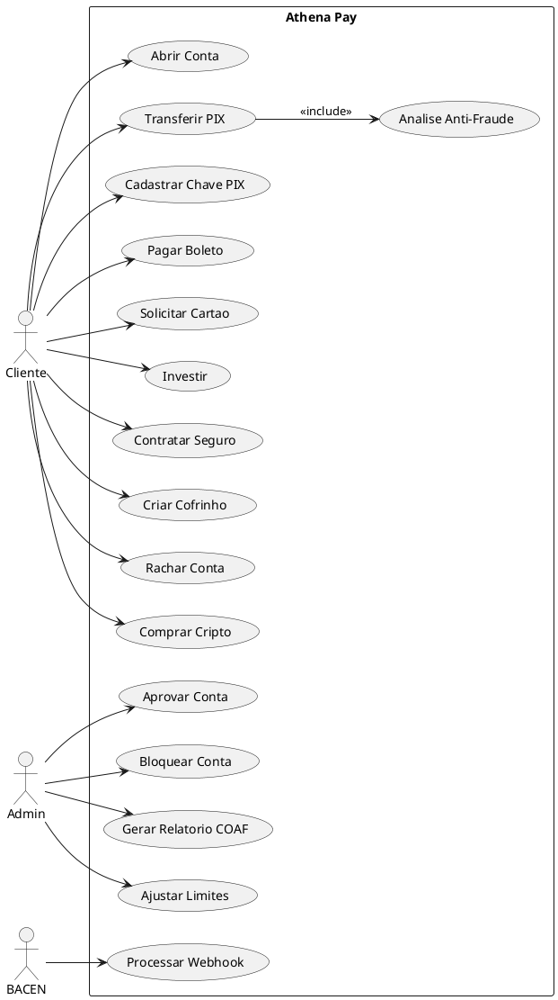
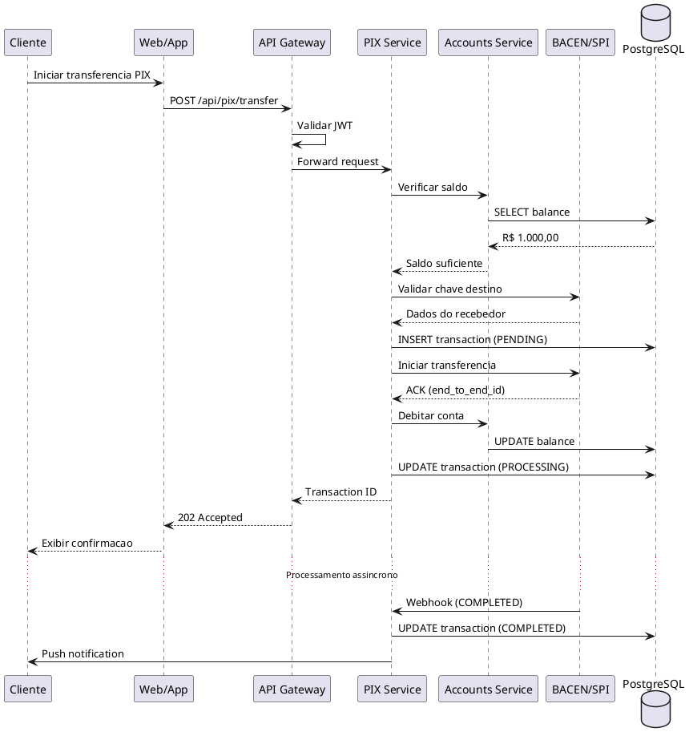
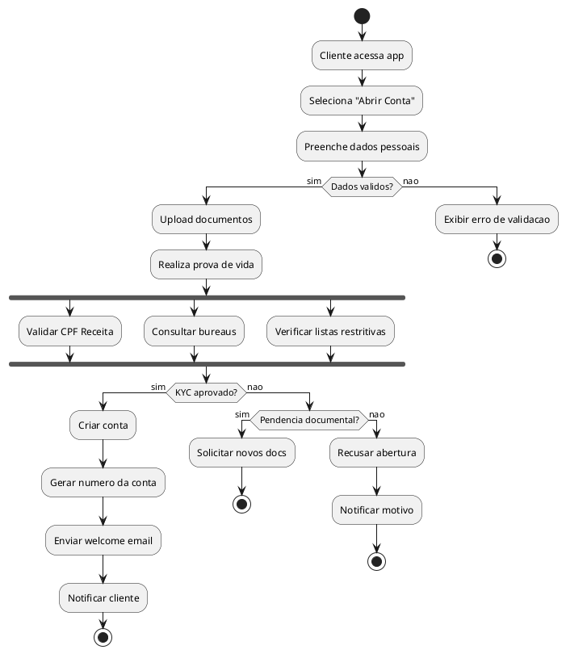

# Athena Pay - Casos de Uso

## Sumario

1. [Atores do Sistema](#atores-do-sistema)
2. [Casos de Uso - Cliente](#casos-de-uso---cliente)
3. [Casos de Uso - Administrador](#casos-de-uso---administrador)
4. [Casos de Uso - Sistema](#casos-de-uso---sistema)
5. [Diagramas UML](#diagramas-uml)

---

## Atores do Sistema

```
┌─────────────────────────────────────────────────────────────────────────────────────┐
│                              ATORES DO SISTEMA                                       │
├─────────────────────────────────────────────────────────────────────────────────────┤
│                                                                                       │
│   ┌───────────────┐   ┌───────────────┐   ┌───────────────┐   ┌───────────────┐    │
│   │   CLIENTE     │   │ ADMINISTRADOR │   │   PARCEIRO    │   │   SISTEMA     │    │
│   │   (PF/PJ)     │   │  (Backoffice) │   │   (API)       │   │   (Externo)   │    │
│   └───────┬───────┘   └───────┬───────┘   └───────┬───────┘   └───────┬───────┘    │
│           │                   │                   │                   │             │
│           ▼                   ▼                   ▼                   ▼             │
│   • Pessoa Física     • Operador          • Empresas         • BACEN/SPI           │
│   • Pessoa Jurídica   • Supervisor        • Fintechs         • CIP/SITRAF          │
│   • MEI               • Compliance        • Marketplaces     • Bureaus             │
│                       • Suporte           • White-label      • Bandeiras           │
│                                                                                       │
└─────────────────────────────────────────────────────────────────────────────────────┘
```

---

## Casos de Uso - Cliente

### UC-001: Abertura de Conta Digital

| Campo | Descricao |
|-------|-----------|
| **ID** | UC-001 |
| **Nome** | Abertura de Conta Digital |
| **Ator Principal** | Cliente (PF/PJ) |
| **Pre-condicoes** | Cliente nao possui conta ativa |
| **Pos-condicoes** | Conta criada e ativa |
| **Fluxo Principal** | 1. Cliente acessa o app/web<br>2. Seleciona "Abrir Conta"<br>3. Preenche dados pessoais (CPF, nome, data nasc)<br>4. Envia documento de identificacao<br>5. Realiza prova de vida (selfie)<br>6. Sistema valida dados via KYC<br>7. Sistema cria conta<br>8. Cliente recebe confirmacao |
| **Fluxo Alternativo** | 5a. KYC reprova - Solicita novos documentos<br>5b. Dados inconsistentes - Notifica e cancela |
| **Regras de Negocio** | RN-001: Idade minima 18 anos<br>RN-002: CPF valido na Receita Federal<br>RN-003: Nao estar em lista restritiva |

---

### UC-002: Transferencia PIX

| Campo | Descricao |
|-------|-----------|
| **ID** | UC-002 |
| **Nome** | Transferencia PIX |
| **Ator Principal** | Cliente |
| **Pre-condicoes** | Cliente autenticado, saldo suficiente |
| **Pos-condicoes** | Transferencia realizada, saldo atualizado |
| **Fluxo Principal** | 1. Cliente acessa area PIX<br>2. Seleciona "Enviar"<br>3. Informa chave PIX destino<br>4. Sistema valida chave via BACEN<br>5. Cliente confirma dados do recebedor<br>6. Informa valor<br>7. Confirma com senha/biometria<br>8. Sistema processa via SPI<br>9. Cliente recebe comprovante |
| **Fluxo Alternativo** | 4a. Chave invalida - Exibe erro<br>6a. Saldo insuficiente - Bloqueia<br>8a. Timeout SPI - Aguarda confirmacao |
| **Regras de Negocio** | RN-010: Limite diurno R$20.000<br>RN-011: Limite noturno R$1.000<br>RN-012: Validacao anti-fraude |

---

### UC-003: Cadastro de Chave PIX

| Campo | Descricao |
|-------|-----------|
| **ID** | UC-003 |
| **Nome** | Cadastro de Chave PIX |
| **Ator Principal** | Cliente |
| **Pre-condicoes** | Conta ativa, limite de chaves nao atingido |
| **Pos-condicoes** | Chave cadastrada e ativa |
| **Fluxo Principal** | 1. Cliente acessa "Minhas Chaves PIX"<br>2. Seleciona "Cadastrar Nova"<br>3. Escolhe tipo (CPF, Email, Celular, EVP)<br>4. Informa valor da chave<br>5. Sistema valida com BACEN<br>6. Cliente confirma<br>7. Sistema registra no DICT |
| **Fluxo Alternativo** | 5a. Chave ja cadastrada em outro banco - Oferece portabilidade<br>5b. Limite atingido - Bloqueia |
| **Regras de Negocio** | RN-020: Maximo 5 chaves por conta PF<br>RN-021: Maximo 20 chaves por conta PJ |

---

### UC-004: Pagamento de Boleto

| Campo | Descricao |
|-------|-----------|
| **ID** | UC-004 |
| **Nome** | Pagamento de Boleto |
| **Ator Principal** | Cliente |
| **Pre-condicoes** | Cliente autenticado, saldo suficiente |
| **Pos-condicoes** | Boleto pago, saldo debitado |
| **Fluxo Principal** | 1. Cliente acessa "Pagar Boleto"<br>2. Escaneia codigo de barras ou digita<br>3. Sistema valida boleto<br>4. Exibe dados (beneficiario, valor, vencimento)<br>5. Cliente confirma pagamento<br>6. Autentica com senha/biometria<br>7. Sistema processa pagamento<br>8. Exibe comprovante |
| **Fluxo Alternativo** | 3a. Boleto vencido - Calcula juros/multa<br>3b. Boleto invalido - Exibe erro<br>7a. Falha no processamento - Tenta novamente |
| **Regras de Negocio** | RN-030: Horario de compensacao 07h-23h<br>RN-031: Limite diario de pagamentos |

---

### UC-005: Solicitar Cartao de Credito

| Campo | Descricao |
|-------|-----------|
| **ID** | UC-005 |
| **Nome** | Solicitar Cartao de Credito |
| **Ator Principal** | Cliente |
| **Pre-condicoes** | Conta ativa, analise de credito aprovada |
| **Pos-condicoes** | Cartao solicitado/emitido |
| **Fluxo Principal** | 1. Cliente acessa area de Cartoes<br>2. Seleciona "Solicitar Cartao"<br>3. Sistema consulta score de credito<br>4. Exibe limite pre-aprovado<br>5. Cliente aceita termos<br>6. Escolhe cartao virtual ou fisico<br>7. Sistema emite cartao<br>8. Cliente recebe dados do cartao virtual |
| **Fluxo Alternativo** | 3a. Score insuficiente - Recusa pedido<br>6a. Fisico - Agenda entrega |
| **Regras de Negocio** | RN-040: Score minimo 500<br>RN-041: Renda comprovada |

---

### UC-006: Investir em Renda Fixa

| Campo | Descricao |
|-------|-----------|
| **ID** | UC-006 |
| **Nome** | Investir em Renda Fixa |
| **Ator Principal** | Cliente |
| **Pre-condicoes** | Perfil de investidor definido, saldo disponivel |
| **Pos-condicoes** | Investimento realizado |
| **Fluxo Principal** | 1. Cliente acessa Investimentos<br>2. Navega para Renda Fixa<br>3. Visualiza opcoes (CDB, LCI, LCA)<br>4. Seleciona produto<br>5. Define valor de aplicacao<br>6. Confirma investimento<br>7. Sistema debita e aplica<br>8. Exibe comprovante |
| **Fluxo Alternativo** | 4a. Produto indisponivel<br>5a. Valor minimo nao atingido |
| **Regras de Negocio** | RN-050: Aplicacao minima R$100<br>RN-051: Verificar suitability |

---

### UC-007: Contratar Seguro

| Campo | Descricao |
|-------|-----------|
| **ID** | UC-007 |
| **Nome** | Contratar Seguro |
| **Ator Principal** | Cliente |
| **Pre-condicoes** | Conta ativa |
| **Pos-condicoes** | Apolice emitida |
| **Fluxo Principal** | 1. Cliente acessa Seguros<br>2. Escolhe tipo (Vida, Auto, Residencial)<br>3. Responde questionario<br>4. Sistema calcula premio<br>5. Exibe cotacao<br>6. Cliente aceita e contrata<br>7. Sistema emite apolice<br>8. Envia documentos por email |
| **Fluxo Alternativo** | 4a. Risco elevado - Recusa ou ajusta premio |
| **Regras de Negocio** | RN-060: Carencia de 30 dias<br>RN-061: Idade maxima para vida 65 anos |

---

### UC-008: Criar Cofrinho (Meta)

| Campo | Descricao |
|-------|-----------|
| **ID** | UC-008 |
| **Nome** | Criar Cofrinho (Meta de Economia) |
| **Ator Principal** | Cliente |
| **Pre-condicoes** | Conta ativa |
| **Pos-condicoes** | Cofrinho criado |
| **Fluxo Principal** | 1. Cliente acessa Cofrinhos<br>2. Seleciona "Criar Novo"<br>3. Define nome e icone<br>4. Define valor da meta<br>5. Define prazo (opcional)<br>6. Confirma criacao<br>7. Sistema cria cofrinho<br>8. Cliente pode transferir valores |
| **Fluxo Alternativo** | 5a. Configurar deposito automatico |
| **Regras de Negocio** | RN-070: Maximo 10 cofrinhos ativos<br>RN-071: Meta minima R$50 |

---

### UC-009: Rachar Conta (Split)

| Campo | Descricao |
|-------|-----------|
| **ID** | UC-009 |
| **Nome** | Rachar Conta (Split de Pagamentos) |
| **Ator Principal** | Cliente |
| **Pre-condicoes** | Conta ativa |
| **Pos-condicoes** | Cobrancas enviadas |
| **Fluxo Principal** | 1. Cliente acessa Split<br>2. Cria novo grupo<br>3. Define valor total<br>4. Adiciona participantes<br>5. Define divisao (igual ou personalizada)<br>6. Sistema gera cobrancas PIX<br>7. Envia links para participantes<br>8. Acompanha pagamentos |
| **Fluxo Alternativo** | 4a. Participante nao tem PIX - Envia QR Code |
| **Regras de Negocio** | RN-080: Maximo 20 participantes<br>RN-081: Valor minimo R$1 por pessoa |

---

### UC-010: Comprar Criptomoedas

| Campo | Descricao |
|-------|-----------|
| **ID** | UC-010 |
| **Nome** | Comprar Criptomoedas |
| **Ator Principal** | Cliente |
| **Pre-condicoes** | Conta ativa, saldo disponivel, termo aceito |
| **Pos-condicoes** | Cripto adquirida |
| **Fluxo Principal** | 1. Cliente acessa Cripto<br>2. Seleciona moeda (BTC, ETH, etc)<br>3. Define valor em BRL<br>4. Sistema exibe cotacao<br>5. Cliente confirma compra<br>6. Autentica transacao<br>7. Sistema executa ordem<br>8. Atualiza carteira cripto |
| **Fluxo Alternativo** | 4a. Cotacao expirada - Atualiza<br>7a. Volatilidade alta - Confirma novamente |
| **Regras de Negocio** | RN-090: Compra minima R$10<br>RN-091: Spread maximo 2% |

---

## Casos de Uso - Administrador

### UC-101: Aprovar Abertura de Conta

| Campo | Descricao |
|-------|-----------|
| **ID** | UC-101 |
| **Nome** | Aprovar Abertura de Conta |
| **Ator Principal** | Administrador (Compliance) |
| **Pre-condicoes** | Solicitacao pendente de aprovacao |
| **Pos-condicoes** | Conta aprovada ou rejeitada |
| **Fluxo Principal** | 1. Admin acessa fila de aprovacoes<br>2. Seleciona solicitacao<br>3. Visualiza documentos e dados KYC<br>4. Verifica listas restritivas (PEP, OFAC)<br>5. Aprova ou rejeita<br>6. Sistema notifica cliente<br>7. Registra auditoria |
| **Fluxo Alternativo** | 5a. Solicita documentos adicionais |
| **Regras de Negocio** | RN-100: SLA de 24h para aprovacao<br>RN-101: Dupla aprovacao para PJ |

---

### UC-102: Bloquear Conta Suspeita

| Campo | Descricao |
|-------|-----------|
| **ID** | UC-102 |
| **Nome** | Bloquear Conta Suspeita |
| **Ator Principal** | Administrador (Seguranca) |
| **Pre-condicoes** | Alerta de fraude ou suspeita |
| **Pos-condicoes** | Conta bloqueada |
| **Fluxo Principal** | 1. Sistema detecta atividade suspeita<br>2. Admin recebe alerta<br>3. Analisa transacoes<br>4. Decide bloqueio<br>5. Executa bloqueio<br>6. Registra motivo<br>7. Notifica compliance<br>8. Cliente e notificado |
| **Fluxo Alternativo** | 4a. Falso positivo - Libera conta |
| **Regras de Negocio** | RN-110: Bloqueio imediato para fraude confirmada<br>RN-111: Comunicar COAF se aplicavel |

---

### UC-103: Gerar Relatorio COAF

| Campo | Descricao |
|-------|-----------|
| **ID** | UC-103 |
| **Nome** | Gerar Relatorio COAF |
| **Ator Principal** | Administrador (Compliance) |
| **Pre-condicoes** | Operacoes suspeitas identificadas |
| **Pos-condicoes** | Relatorio enviado ao COAF |
| **Fluxo Principal** | 1. Sistema identifica operacoes suspeitas<br>2. Admin revisa operacoes<br>3. Seleciona para reporte<br>4. Sistema gera arquivo COAF<br>5. Admin valida dados<br>6. Envia ao SISCOAF<br>7. Registra protocolo<br>8. Arquiva evidencias |
| **Fluxo Alternativo** | 5a. Dados incompletos - Complementa |
| **Regras de Negocio** | RN-120: Prazo de 24h para comunicacao<br>RN-121: Retencao de 5 anos |

---

### UC-104: Ajustar Limite de Cliente

| Campo | Descricao |
|-------|-----------|
| **ID** | UC-104 |
| **Nome** | Ajustar Limite de Cliente |
| **Ator Principal** | Administrador |
| **Pre-condicoes** | Solicitacao de ajuste |
| **Pos-condicoes** | Limite atualizado |
| **Fluxo Principal** | 1. Admin acessa gestao de clientes<br>2. Busca cliente<br>3. Visualiza limites atuais<br>4. Define novos limites<br>5. Justifica alteracao<br>6. Sistema valida politica<br>7. Aplica alteracao<br>8. Notifica cliente |
| **Fluxo Alternativo** | 6a. Excede politica - Requer aprovacao superior |
| **Regras de Negocio** | RN-130: Aumento maximo 100% por vez<br>RN-131: Analise de risco obrigatoria |

---

## Casos de Uso - Sistema

### UC-201: Processar Webhook BACEN

| Campo | Descricao |
|-------|-----------|
| **ID** | UC-201 |
| **Nome** | Processar Webhook BACEN |
| **Ator Principal** | Sistema BACEN |
| **Pre-condicoes** | Transacao PIX pendente |
| **Pos-condicoes** | Transacao concluida |
| **Fluxo Principal** | 1. BACEN envia webhook<br>2. Sistema valida assinatura<br>3. Identifica transacao<br>4. Atualiza status<br>5. Credita/Debita conta<br>6. Notifica cliente<br>7. Registra auditoria |
| **Fluxo Alternativo** | 2a. Assinatura invalida - Rejeita<br>3a. Transacao nao encontrada - Registra erro |
| **Regras de Negocio** | RN-200: Timeout de 5 segundos<br>RN-201: Idempotencia obrigatoria |

---

### UC-202: Executar Analise Anti-Fraude

| Campo | Descricao |
|-------|-----------|
| **ID** | UC-202 |
| **Nome** | Executar Analise Anti-Fraude |
| **Ator Principal** | Sistema (Motor de Fraude) |
| **Pre-condicoes** | Transacao em processamento |
| **Pos-condicoes** | Score de risco calculado |
| **Fluxo Principal** | 1. Recebe dados da transacao<br>2. Consulta historico do cliente<br>3. Verifica device fingerprint<br>4. Analisa padroes comportamentais<br>5. Consulta listas negras<br>6. Calcula score de risco<br>7. Decide aprovar/bloquear/revisar<br>8. Retorna decisao |
| **Fluxo Alternativo** | 7a. Score alto - Envia para revisao manual |
| **Regras de Negocio** | RN-210: Score > 80 = bloqueio automatico<br>RN-211: Score 50-80 = revisao manual |

---

### UC-203: Processar Liquidacao D+0

| Campo | Descricao |
|-------|-----------|
| **ID** | UC-203 |
| **Nome** | Processar Liquidacao D+0 |
| **Ator Principal** | Sistema (Batch) |
| **Pre-condicoes** | Transacoes pendentes de liquidacao |
| **Pos-condicoes** | Transacoes liquidadas |
| **Fluxo Principal** | 1. Job inicia as 18h<br>2. Coleta transacoes do dia<br>3. Agrupa por banco destino<br>4. Gera arquivo de liquidacao<br>5. Envia para CIP<br>6. Aguarda confirmacao<br>7. Atualiza status<br>8. Gera relatorio |
| **Fluxo Alternativo** | 6a. Rejeicao - Tenta novamente D+1 |
| **Regras de Negocio** | RN-220: Horario limite 18h<br>RN-221: Retry maximo 3 vezes |

---

## Diagramas UML

### Diagrama de Casos de Uso - Visao Geral



### Diagrama de Sequencia - PIX Transfer



### Diagrama de Atividades - Abertura de Conta



---

## Matriz de Rastreabilidade

| Caso de Uso | Requisito Funcional | Requisito Nao-Funcional | Servico |
|-------------|---------------------|------------------------|---------|
| UC-001 | RF-001, RF-002 | RNF-001 (SLA 24h) | accounts-service, kyc-service |
| UC-002 | RF-010, RF-011 | RNF-010 (Latencia < 3s) | pix-service, accounts-service |
| UC-003 | RF-020 | RNF-020 (Disponibilidade 99.9%) | pix-service |
| UC-004 | RF-030, RF-031 | RNF-030 (Horario 7h-23h) | boleto-service, payments-service |
| UC-005 | RF-040, RF-041 | RNF-040 (Score minimo) | cards-service, kyc-service |
| UC-006 | RF-050 | RNF-050 (Suitability) | investments-service |
| UC-007 | RF-060 | RNF-060 (Carencia) | insurance-service |
| UC-008 | RF-070 | RNF-070 (Max 10) | accounts-service |
| UC-009 | RF-080 | RNF-080 (Max 20 participantes) | payments-service |
| UC-010 | RF-090 | RNF-090 (Spread 2%) | fx-crypto-service |

---

*Last Updated: January 2026*
*Version: 1.0*
